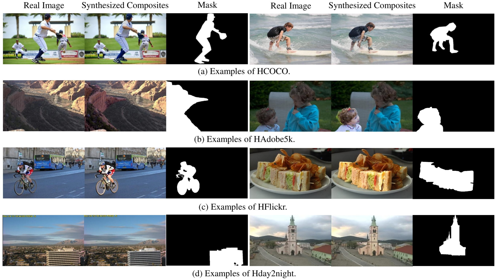

# Image_Harmonization_Datasets

**Image Harmonization** is to harmonize a composite image by adjusting its foreground appearances consistent with the background region. A real composite image is generated by a foreground region of one image combined with the background of another image. Though it's easy to create real composite images, the harmonized outputs are too time-consuming and skill-demanding to generate. So there is no high-quality publicly available dataset for image harmonization.

Our dataset is a synthesized dataset for Image Harmonization. It contains 4 sub-datasets: HCOCO, HAdobe5k, HFlickr, and Hday2night, each of which contains synthesized composite images, foreground masks of composite images and corresponding real images. The whole dataset is provided in  [Baidu Cloud](<https://pan.baidu.com/s/1DaepFq0l8XHiG8dhQr8EBw>)

| |HCOCO|HAdobe5k|HFlickr|Hday2night|
|:--:|:--:|:--:|:--:|:--:|
|Traning set| 38545 |19437| 7449 |311|
|Test set| 4283 |2160| 828 |133|

- ### HCOCO

HCOCO, containing 42k synthesized composite images, is generated based on [Microsoft COCO](<http://cocodataset.org/>) dataset. The foreground region is corresponding object segmentation mask provided from COCO. Within the foreground region, the appearance of COCO image is edited using various color transfer methods. The sub-dataset and training/testing split are provided in [Baidu Cloud](https://pan.baidu.com/s/1bMTNzFJMreOOE-Lz3c7hGg)

- ### HAdobe5k

HAdobe5k is generated based on [MIT-Adobe FiveK](<http://data.csail.mit.edu/graphics/fivek/>) dataset. Provided with 6 editions of the same image, we manually segment the foreground region and exchange foregrounds between 2 versions. The sub-dataset and training/testing split are provided in [Baidu Cloud](https://pan.baidu.com/s/1NAtLnCdY1-4uxRKB8REPQg)

- ### HFlickr

We collected 4833 images from [Flickr](<https://www.flickr.com/>). After manually segmenting the foreground region, we use the same method as HCOCO to generate HFlickr sub-dataset. The sub-dataset and training/testing split are provided in [Baidu Cloud](https://pan.baidu.com/s/1ZaCYo9Z21RGVgCwXgtvmbw) 

- ### Hday2night

Hday2night is generated based on [day2night](https://pan.baidu.com/s/1bCtVhhtb_EDool_UnN2Bjw) dataset. We manually segment the foreground region, which is cropped and overlaid on another image captured on a different time. The sub-dataset and training/testing split are provided in [Baidu Cloud](https://pan.baidu.com/s/1wTqGeB9SMweS5UAaxWof8A)

# Baselines

### Lalonde

J.-F. Lalonde et al. provides their implementation of ICCV 2007 paper:  Using color compatibility for assessing image realism in their [GitHub](https://github.com/jflalonde/colorRealism).

And we have arranged the code to a "click-and-run" way. 
`demo.m` is available in `/lalonde/colorStatistics/mycode/demo/`. 
Don't forget to specify the path of the code and results in your computer in `getPathName.m`, and run `setPath.m` before run `demo.m`to get everything ready.

### Xue

This is Xue's implementation of their paper in 2012 ACM Transactions on Graphics: Understanding and improving the realism of image composites 

`demo.m` is available in `/xue/demo/`. 

Notice to add the path of all dependent files using `addpath(genpath('../dependency'))`.

### Zhu

Jun-Yan Zhu released the code of their ICCV 2015 paper: Learning a discriminative model for the perception of realism in composite images in their [GitHub](<https://github.com/junyanz/RealismCNN>).

Notice that it requires matcaffe interface. We make some changes corresponds to our dataset including how to preprocess data and how to save the harmonized results. Don't forget to specify `DATA_DIR`,`MODEL_DIR` and `RST_DIR` before running `demo.m`.

### DIH

This is a Tensorflow implementation based on the caffe network released by the original authors in their [GitHub](<https://github.com/wasidennis/DeepHarmonization>).

Besides, we also discard one inner-most convolutional layer and one inner- most deconvolutional layer to make it suitable for input of 256*256 size.

To train DIH, 

`python train.py --data_dir <Your Path to Dataset> --init_lr 0.0001 --batch_size 32`

Don't forget to specify the directory of Image Harmonization Dataset after `data_dir`.

### U-net

This code of CVPR 2017: Image-to-Image Translation with Conditional Adversarial Networks,  is released by Jun-Yan Zhu in their [GitHub](<https://github.com/junyanz/pytorch-CycleGAN-and-pix2pix>)

Since our dataset is not organized to be like a normally aligned dataset, we have to implement image loading and processing part according to our dataset. For more details, you could refer to `data/ihd_dataset.py`. We implement the U-net backbone based on Zhu's implementation of unet 256. and train it alone instead of in an adversarial manner. Refer to `unet_model.py` for more details.

To train U-net:

`python train_g.py  --dataroot ./datasets/ihd/ --name unet --model unet --gpu_ids 1 --dataset_mode ihd --is_train 1 --no_flip --preprocess none --norm instance`

**When using images from our dataset, please cite this dataset using the following BibTeX**:

@misc{cong2019deep,
​    title={Deep Image Harmonization via Domain Verification},
​    author={Wenyan Cong and Jianfu Zhang and Li Niu and Liu Liu and Zhixin Ling and Weiyuan Li and Liqing Zhang},
​    year={2019},
​    eprint={1911.13239},
​    archivePrefix={arXiv},
​    primaryClass={cs.CV}
}

